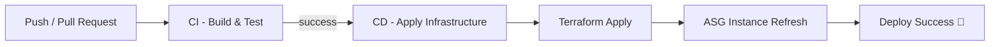

# 🧩 CI/CD Workflow Documentation

## 🚀 Workflow 1: CI - Build and Test

### 🧭 Mục tiêu

Workflow này đóng vai trò **cổng kiểm soát chất lượng (Quality Gate)** — đảm bảo rằng mọi thay đổi trong **mã nguồn ứng dụng** hoặc **cơ sở hạ tầng** đều được kiểm tra và xác thực trước khi triển khai.

---

### ⚙️ 1.1. Kích hoạt (Triggers)

Workflow được kích hoạt trong các trường hợp sau:

* Khi có **pull request** được tạo hoặc cập nhật nhắm vào nhánh `development` hoặc `master`.
* Khi có **push (commit)** được đẩy lên các nhánh `development` hoặc `master`.

---

### 🧱 1.2. Các công việc (Jobs)

#### 🔹 a. changes – Phát hiện các khu vực thay đổi

**Mục đích:**
Xác định các phần thay đổi trong commit mới nhất (ứng dụng, hạ tầng, hay workflow).

**Luồng hoạt động:**

1. Checkout mã nguồn.
2. Phân tích file thay đổi bằng action [`dorny/paths-filter`](https://github.com/dorny/paths-filter).
3. Tạo các output:

   * `app` → thay đổi trong `src/**`
   * `infra` → thay đổi trong `terra-config/**`
   * `workflows` → thay đổi trong `.github/workflows/**`

Các output này sẽ được sử dụng để quyết định job nào cần chạy tiếp theo.

---

#### 🔹 b. tf-validate – Xác thực mã Terraform

**Mục đích:**
Đảm bảo cú pháp Terraform hợp lệ.

**Điều kiện chạy:**
Chỉ chạy khi có `pull_request` **và** có thay đổi trong thư mục `terra-config`.

**Luồng hoạt động:**

1. Checkout mã nguồn.
2. Cài Terraform bằng action [`hashicorp/setup-terraform`](https://github.com/hashicorp/setup-terraform).
3. Chạy:

   ```bash
   terraform init -backend=false
   terraform validate
   ```

---

#### 🔹 c. test – Kiểm thử ứng dụng Node.js

**Mục đích:**
Chạy các bài **unit test** hoặc **integration test** để đảm bảo tính ổn định của ứng dụng.

**Điều kiện chạy:**
Chỉ chạy khi có `pull_request` **và** có thay đổi trong thư mục `src`.

**Luồng hoạt động:**

1. Checkout mã nguồn.
2. Thiết lập môi trường Node.js với phiên bản chỉ định.
3. Cài dependencies:

   ```bash
   npm ci
   ```
4. Chạy test:

   ```bash
   npm test
   ```

---

#### 🔹 d. build-and-push – Xây dựng và đẩy Docker Image

**Mục đích:**
Build ứng dụng thành Docker image và đẩy lên **Docker Hub**.

**Điều kiện chạy:**
Chỉ chạy khi có **push** lên `development` hoặc `master` **và** có thay đổi trong mã nguồn ứng dụng.

**Luồng hoạt động:**

1. Checkout mã nguồn.
2. Thiết lập Docker Buildx.
3. Đăng nhập DockerHub:

   ```bash
   docker login -u $DOCKERHUB_USER -p $DOCKERHUB_PAT
   ```
4. Tạo tag image:

   * Nhánh `master`: `prod-<short_sha>`, `latest`
   * Nhánh `development`: `dev-<short_sha>`, `dev-latest`
5. Build và push image bằng action [`docker/build-push-action`](https://github.com/docker/build-push-action).

---

## 🌩️ Workflow 2: CD - Apply Infrastructure (ASG Refresh)

### 🧭 Mục tiêu

Workflow này đảm nhiệm **triển khai tự động (Continuous Deployment)** sau khi CI hoàn tất thành công — chỉ triển khai **mã nguồn đã qua kiểm thử và build hợp lệ**.

---

### ⚙️ 2.1. Kích hoạt (Triggers)

* **workflow_run:**
  Tự động kích hoạt khi workflow **CI - Build and Test** hoàn tất thành công (`conclusion == 'success'`).
* **workflow_dispatch:**
  Cho phép chạy thủ công từ GitHub Actions với tùy chọn chọn môi trường (`dev` hoặc `prod`).

---

### 🔄 2.2. Đồng bộ hóa (Concurrency)

```yaml
concurrency:
  group: terraform-${{ github.workflow }}-${{ github.ref }}
  cancel-in-progress: false
```

→ Đảm bảo chỉ một workflow CD được chạy đồng thời trên cùng nhánh, tránh xung đột triển khai.

---

### 🏗️ 2.3. Công việc (Job): deploy-infra

#### Luồng hoạt động chi tiết

1. **Checkout code at CI commit**
   → Checkout chính xác commit đã được xác thực trong CI để đảm bảo đồng nhất.

2. **Determine environment**

   * `workflow_run` → xác định theo nhánh (`master` → `prod`, nhánh khác → `dev`)
   * `workflow_dispatch` → lấy từ input người dùng
     → Thiết lập biến môi trường: `ENVIRONMENT`, `IMAGE_TAG`, `NODE_ENV`

3. **Configure AWS Credentials**
   → Đăng nhập AWS bằng action [`aws-actions/configure-aws-credentials`](https://github.com/aws-actions/configure-aws-credentials).

4. **Setup Terraform**
   → Cài Terraform phiên bản được chỉ định.

5. **Get AWS Account ID**
   → Lấy ID tài khoản AWS để đặt tên tài nguyên động.

6. **Bootstrap Terraform backend bucket**
   → Kiểm tra (và tạo nếu cần) S3 bucket `tfstate-<account_id>-<region>` để lưu Terraform state.

7. **Terraform Init (switch to remote S3 backend)**

   ```bash
   terraform init -reconfigure -backend-config="..."
   ```

8. **Select/Create Workspace**
   → Tách biệt state giữa môi trường `dev` và `prod`.

9. **Detect infra changes & Detect app changes**
   → Xác định xem có thay đổi trong `terra-config/` hoặc `src/` không để quyết định hành động tiếp theo.

10. **Check if existing infra exists**
    → Kiểm tra state hiện tại để biết có hạ tầng cũ không.

11. **Destroy existing infra (có điều kiện)**
    → Nếu có thay đổi hạ tầng và hạ tầng cũ tồn tại, chạy:

    ```bash
    terraform destroy -auto-approve
    ```

12. **Apply infra**

    ```bash
    terraform apply -auto-approve
    ```

    → Tạo/cập nhật các tài nguyên: VPC, Subnets, Security Groups, ALB, Launch Template, ASG,...

13. **Read outputs**
    → Lấy thông tin như DNS ALB, tên ASG,...

14. **Trigger Instance Refresh (có điều kiện)**
    → Gửi lệnh `start-instance-refresh` đến AWS ASG để cập nhật image mới theo cơ chế rolling update (zero-downtime).

15. **Auto-destroy infrastructure after success (dev only)**
    → Sau khi triển khai thành công ở môi trường `dev`, chờ 5 phút rồi tự động:

    ```bash
    terraform destroy -auto-approve
    ```

    → Giúp tiết kiệm chi phí dev/test.

16. **Cleanup on Terraform failure or cancel**
    → Nếu workflow thất bại hoặc bị hủy, thực thi cleanup:

    ```bash
    terraform destroy -auto-approve
    ```

---

## 📈 Tổng quan luồng CI/CD



---

## 🔐 Secrets & Variables

| Tên                     | Mục đích                  |
| ----------------------- | ------------------------- |
| `AWS_ACCESS_KEY_ID`     | Truy cập AWS              |
| `AWS_SECRET_ACCESS_KEY` | Truy cập AWS              |
| `DOCKERHUB_USER`        | Tài khoản DockerHub       |
| `DOCKERHUB_PAT`         | Token đăng nhập DockerHub |

---

## 🧾 Ghi chú

* CI đảm bảo **kiểm thử và build** trước khi triển khai.
* CD đảm bảo **triển khai an toàn, không downtime** với cơ chế **ASG Instance Refresh**.
* Môi trường `dev` được **tự động cleanup** để tối ưu chi phí.

